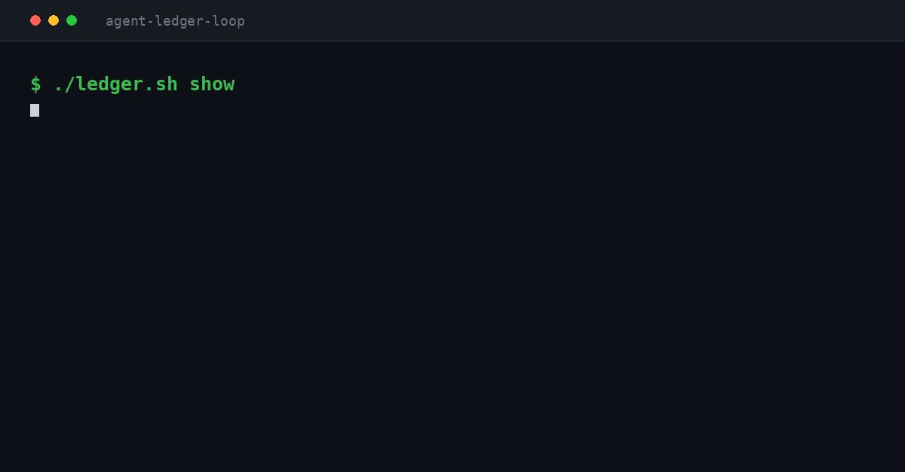

# agent-ledger-loop

A reference implementation for running a coding agent unattended for days, where the
state lives on disk instead of in the model's context.



254 lines of bash. The code is not the point; the six rules are. They came out of
one 20-hour run against a real codebase, and each one is here because something measurably
broke without it.

## The measurements

| What | Number |
|---|---|
| Continuous unattended run | 20 hours |
| Phases delivered, each behind a passing gate | 34 |
| Rounds | 25 |
| Rounds needing a second attempt | 0 |
| Median time per phase | ~51 min |
| LLM judge asked "is the goal met?" | said yes with 2 of 3 steps undone |
| Concurrent writes to the ledger, no lock | 1 of 20 survived |
| Same writes through `ledger.sh` | 20 of 20 |

## The six rules

**1. The stop condition is a command, not a judgement.**

```bash
./ledger.sh remaining     # finished only when this prints 0
```

The first version used the harness's built-in goal hook, which asks a model to decide
whether the goal is met. It declared success while its own explanation admitted two of
three steps had not happened. A number has no opinion. Replace the judge, do not tune it.

**2. Fresh context per phase. The disk is the only handoff.**

One process per phase, then it dies. The next one reconstructs what it needs from
`LEDGER.md`, `git log` and the plan file. This is not summarisation, it is re-reading the
source, so nothing degrades over 40 phases.

An agent cannot restart itself with a clean context: that lever does not exist from the
inside. Compaction is lossy summarisation, not a reset. Something outside the process has
to call it again, and that something is a `while` loop.

**3. Splitting a phase means adding lines, never removing them.**

When a phase turns out too big, the agent appends its sub-phases to the ledger and commits
that before writing any code. In the reference run one line became 22. The pending count
went from 7 to 28 in forty minutes.

The count going up is the mechanism working. Scope became visible. The failure mode this
prevents is the agent quietly delivering a third of a phase and marking it done.

**4. A line flips to DONE only behind a passing gate.**

`typecheck && tests && coverage`, exit 0, or the line stays PENDING. The agent does not
get to grade its own homework in prose.

**5. Ambiguity does not block. It gets recorded.**

The agent is forbidden from asking questions. When it hits a business rule that is missing
or contradictory, it writes to `DECISIONS.md`: what it measured, what is open, and the
conservative assumption it adopted. Then it keeps going.

This is the third option between an agent that interrupts you every ten minutes and one
that decides silently and never tells you. In the reference run it produced 95 entries.
Reviewing 7 of them was enough; 2 were reversed, and each reversal became a new ledger
line. The work never stopped once.

**6. One serialised write path.**

Several processes read-modify-write the same file. Without a lock, whoever read first and
wrote last silently erases the other. Measured on this exact file shape: of 20 concurrent
writes, **1 survived**. No error, no log, no corruption. Just 19 writes that never
happened.

```bash
# reproduce the red, then the green
./test-race.sh
```

## Files

| File | What it is |
|---|---|
| `loop.sh` | the while-loop: one agent process per phase |
| `ledger.sh` | the only write path, serialised with `flock` |
| `LEDGER.md` | the state: one line per phase, `PENDING` / `DONE` / `MANUAL` |
| `PHASE_PROMPT.md` | what each round is told; edit this, not the loop |
| `DECISIONS.md` | the journal of assumptions taken without you |
| `status.sh` | answers "is it finished?" without guessing |

## Running it

```bash
./loop.sh          # foreground, watch the first phase
./status.sh        # remaining, done, rounds, and whether it is alive
touch STOP         # finishes the current phase, then exits cleanly
```

Every round gets its own session id, printed before the call, so a phase that ran at 4am
can be opened and read afterwards.

## Guardrails, and why each one is there

| Guard | Prevents |
|---|---|
| `MAX_ATTEMPTS` on the same line | burning tokens all night on one stuck phase |
| `MAX_ROUNDS` ceiling | an infinite loop caused by a bug in this script |
| pid lock file | two loops fighting over the same working tree |
| `STOP` file | stopping cleanly instead of `Ctrl+C` mid-phase |
| preflight call | discovering an invalid flag after 30 wasted minutes |
| backoff on non-zero exit | hammering the API through a usage limit |

The deny rules in your harness config still apply inside every round. That is the real
safety net: an agent running for 20 hours will not remember a rule in a prompt as reliably
as the tool refuses to run the command.

## What this does not solve

- **No cost ceiling.** It stops on attempts, not on dollars spent.
- **No memory between rounds** beyond what is written to disk. `DECISIONS.md` is a partial
  answer, which is why it grows to 95 entries.
- **The prompt lives in one file** and is not versioned per phase type.
- **It assumes your gate is honest.** If your test suite does not fail when the code is
  wrong, none of this helps.

## Prior art and the honest caveat

Loops around a coding CLI are not new, and the harnesses themselves keep shipping pieces
of this: goal hooks, interval loops, multi-agent workflows, background sessions. All of
those keep a single context. The distinction here is the fresh process per phase with the
disk as the sole handoff, and the six rules around it.

If your vendor ships this natively next month, good. The rules survive; the bash is
disposable.

MIT.
